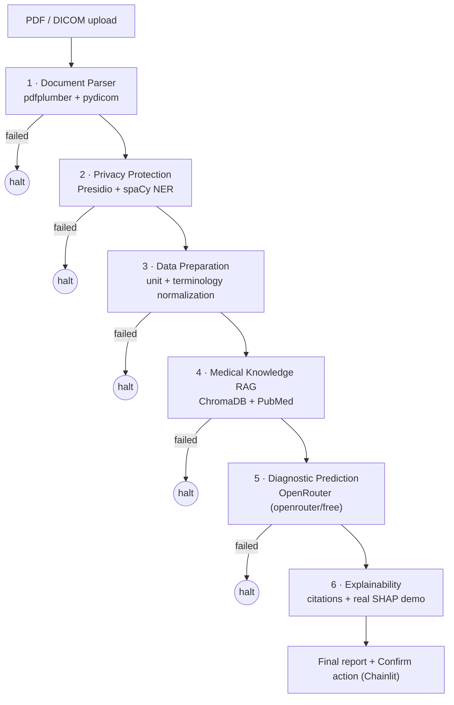

# Glassbox MD

An explainable medical AI agent pipeline: six agents that turn imaging,
labs, and symptoms into a diagnosis a clinician can actually audit, not
just trust.

> **Educational / portfolio demonstration of a multi-agent explainable-AI
> architecture. Not an FDA-cleared or clinically validated medical device.
> Not validated for diagnostic accuracy. Must not be used with real patient
> data (PHI) or to inform actual clinical decisions. All outputs are
> illustrative only, not medical advice, and require qualified clinician
> review before any action.**
>
> See [`src/glassbox_md/disclaimer.py`](src/glassbox_md/disclaimer.py) --
> this text is defined once there and reused everywhere it needs to appear.

## Why this exists

The pitch this project is built from opens with a problem, not a feature
list: *"They can't just trust a 'black box' algorithm. They need to know
why a decision is made."* Six agents (parse → de-identify → normalize →
retrieve literature → predict → explain) exist to answer that, in order.

The full project brief -- research grounding in two cited papers, a
five-lens architecture critique, the revised design, risk table, and
roadmap this scaffold is built from -- lives in the published project
artifact (link in your conversation history). This README covers the code,
not the reasoning behind it.

## Architecture



`needs_review` (an implausible lab value, a low-confidence differential, a
close-call disagreement) is not shown above as its own branch because it
doesn't change the routing -- it continues to the next stage like `ok`
does, carrying the flag forward into the final report. Only `failed`
(nothing usable was produced) halts the pipeline early. See "Conditional
routing" under Design decisions below.

## Status

**Phases 0-9 done -- MVP complete.** All six agents, wired into one
pipeline, with a working UI, validated across a spread of synthetic
cases. 98 automated tests passing, plus two things pytest can't check by
itself: a live OpenRouter call (Phase 5) and a full manual run of the UI
in a real browser (Phase 8) -- see both below.

Run it: `chainlit run app.py -w`, then open the local URL it prints.

**Phase 9 validation** (`tests/test_validation.py`) ran 8 diverse
synthetic cases through the real compiled pipeline -- not just the one
happy path Phase 7's own capstone test covers: a clean diabetes case, a
clean coronary-artery-disease case, an implausible lab value (flagged,
not blocked), an unrecognized lab test (halts cleanly, no crash), a
genuinely empty document (halts cleanly at the RAG stage, no crash), a
DICOM image alongside lab data (PHI-bearing tags confirmed stripped), a
close-call differential (correctly flagged for review), and a case with
five different planted PHI-shaped identifiers (name, DOB, SSN, MRN,
DICOM patient name) swept against the *entire* downstream state as one
serialized blob -- not just checked in one field the way Phase 3's own
test did -- confirming none of them survive anywhere past the Privacy
Protection Agent.

**What the live verification actually confirmed** (a real synthetic PDF,
uploaded through the running app, no mocks): all six agents rendered as
individual steps with correct status icons live as the graph executed;
the Medical Knowledge RAG agent correctly showed `needs_review` (no
literature index had been built); the Diagnostic Prediction agent made a
real OpenRouter call and correctly abstained (0.30 confidence, no lab
values in the test document); the Explainability agent assembled a report
with a real SHAP demo and a disagreement flag; the persistent disclaimer
banner rendered above everything; and the "Confirm reviewed" action
button worked -- sent a confirmation message and removed itself. See
`.files/` note under Design decisions for a real gap this testing found.

## Project structure

```
healthcare/
├── app.py                          Chainlit UI -- run with `chainlit run app.py -w` (done)
├── chainlit.md                     welcome-screen markdown (shown before first upload)
├── .chainlit/config.toml           name, file-upload limits, custom_css wiring
├── public/banner.css               the persistent disclaimer banner (pure CSS, no JS)
├── docs/
│   └── reference-images/     the 11 original pitch screenshots this project is built from
├── src/glassbox_md/
│   ├── state.py               MedicalPipelineState -- the LangGraph state schema
│   ├── audit.py                shared helper for building audit log entries
│   ├── disclaimer.py          the intended-use disclaimer, defined once
│   ├── pipeline.py             wires all six agents into one LangGraph StateGraph (done)
│   └── agents/
│       ├── data_preparation.py   unit conversion + terminology normalization (done)
│       ├── document_parser.py    PDF (pdfplumber) + DICOM (pydicom), separate paths (done)
│       ├── privacy_protection.py NER redaction, lab extraction, DICOM tag stripping (done)
│       ├── medical_knowledge_rag.py PubMed fetch + ChromaDB index/query (done)
│       ├── diagnostic_prediction.py Structured differential via OpenRouter (done)
│       └── explainability.py       Citation-grounded narrative + real SHAP demo (done)
├── scripts/
│   └── build_literature_index.py  offline: fetch PubMed, build the RAG index
├── data/
│   ├── README.md              what goes in each subfolder, and what must never go there
│   ├── imaging/                public/synthetic imaging data only
│   ├── tabular/                public tabular data, for the real SHAP demo
│   ├── literature/             PubMed abstract cache for the RAG agent
│   └── synthetic_patients/     self-generated fake documents, for testing redaction
├── tests/
│   ├── test_state.py           tests for the privacy-boundary runtime guard
│   ├── test_pipeline.py        conditional routing + full end-to-end graph test
│   └── test_validation.py      Phase 9: 8 diverse synthetic cases, full-state PII sweep
├── requirements.txt           dependencies, grouped by the phase that introduces them
├── pyproject.toml             project metadata + pytest config
└── .env.example                copy to .env and fill in API keys (never commit .env)
```

## Setup

```bash
python -m venv .venv
.venv\Scripts\activate        # Windows
pip install -r requirements.txt   # or just the Phase 0 group -- see requirements.txt
pip install -e .
copy .env.example .env        # then fill in your API key(s)
pytest
```

`requirements.txt` lists every phase's dependencies up front so the shape
of the environment is visible, but several groups (spaCy's language
model, chromadb's first embedding-model download, shap's native build)
are slow and better installed deliberately when you reach that phase
rather than as a side effect of one big install.

To make the RAG agent actually return results (Phase 4), build the
literature index once, offline:

```bash
python scripts/build_literature_index.py
```

This fetches PubMed abstracts for the project's two target conditions
and indexes them into `data/literature/chroma/`. Takes a few minutes;
safe to re-run.

To run the UI (Phase 8), with `.env` filled in (`OPENROUTER_API_KEY` at
minimum):

```bash
chainlit run app.py -w
```

`-w` enables auto-reload on file changes. Opens at `http://localhost:8000`.
Upload a lab-report/history PDF and/or a DICOM file to run it through
the pipeline; each agent renders as its own step as it completes.

## Known limitations

Scoped deliberately, not accidentally -- each of these is discussed in
more depth under Design decisions below, but a portfolio reviewer
shouldn't have to read thirty bullet points to find the honest gaps:

- **Two conditions only** (type 2 diabetes, coronary artery disease), not
  general medicine -- an unrecognized lab test or condition is rejected,
  not silently guessed at.
- **RAG is flat vector search**, not the 3-tier graph (patient →
  literature → controlled vocabulary) the project's own architecture
  critique recommended for real citation traceability. A V2 item.
- **The SHAP demo never explains the current patient.** It runs on a
  public dataset, by design, and says so in the report -- see why under
  Design decisions. Explaining an actual case is the citation-grounded
  narrative's job, not SHAP's, in this design.
- **PII redaction covers 8 of the 18 HIPAA Safe Harbor identifier
  categories** (names, dates, phone/fax, email, geographic subdivisions,
  SSNs, URLs, IPs, plus a custom medical-record-number pattern) via
  Presidio + spaCy. Biometric identifiers, full-face photographs
  (pixel-level DICOM defacing), and vehicle identifiers are not
  addressed -- listed explicitly in `privacy_protection.py`, not implied
  away.
- **No case-persistence layer.** Each chat session is one ephemeral run;
  "Confirm reviewed by clinician" sends a message and nothing else --
  there's no stored record for it to update yet.
- **The LLM provider is a free-tier router** (`openrouter/free`), chosen
  after two dead ends with paid/blocked providers (see below). Expect
  ~70s latency and don't expect a fixed model identity from run to run --
  not a production-grade reliability story.
- **No formal clinical validation** -- no accuracy, sensitivity, or
  specificity metrics against a labeled dataset, and none are claimed.
  This is a portfolio demonstration of an architecture, not a validated
  diagnostic tool; see the disclaimer at the top of this file.
- **English-only.** `en_core_web_sm`'s NER recall on non-English or
  unusual names is not something this project has tested or tuned for.

## Design decisions worth knowing

- **State schema.** `MedicalPipelineState` adds a `stage_status` dict and
  an accumulating `audit_log` on top of the original design, so a failed
  node can be routed instead of crashing the whole chain, and the
  pipeline's own reasoning trail lives in the state -- not just in the
  final report string.
- **Privacy boundary.** `assert_privacy_boundary_respected()` is a runtime
  check, not just a type hint: it raises if `raw_input_paths` (which can
  embed PHI in a filename) is still present once `anonymized_patient_data`
  exists. Call it at the boundary of any node that isn't the parser or
  privacy agent, especially before the two nodes that call an external API.
- **UI (Phase 8, not yet built): Chainlit**, not Streamlit or Gradio.
  Chainlit's native step/thread view maps directly onto a six-agent
  pipeline -- each agent renders as its own collapsible step with its own
  output, which is a better fit for a project about showing *how* an
  answer was reached than a generic chat widget or form-builder is.
- **`stage_status` merge gotcha, found while building Phase 1.** Only
  `audit_log` has a LangGraph reducer (`operator.add`, so it accumulates
  automatically). `stage_status` doesn't -- a node that returned
  `{"stage_status": {"data_preparation": ...}}` directly would silently
  wipe out every other stage's recorded status, not merge into it. Every
  agent must build its update through `update_stage_status()` in
  `state.py` instead. Covered by
  `test_agent_preserves_other_stages_status` in
  `tests/test_data_preparation.py` -- when you write Phase 2's agent,
  write the equivalent regression test before assuming this works.
- **PDF parsing: pdfplumber, not Marker/Docling as originally pitched.**
  Both of those are ML-based parsers built for messy scanned documents and
  pull in torch as a transitive dependency -- a multi-hundred-MB-to-GB
  install for what this MVP needs, which is text extraction from synthetic,
  born-digital PDFs this project generates itself. DICOM still gets its
  own separate path via pydicom, per the critique's finding that neither
  Marker nor Docling reads DICOM at all regardless of which one you'd
  picked. See `agents/document_parser.py`'s module docstring for the
  swap-back path if this project is ever pointed at real scanned documents.
- **DICOM pixel data never enters LangGraph state.** `parse_dicom()`
  returns a shape/dtype summary, not the raw array -- keeping large binary
  imaging data out of the state dict avoids the same unbounded-PHI-copy
  risk the critique raised about LangGraph checkpointing. Anything that
  needs actual pixel data reads it from the file path directly.
- **Structured lab extraction lives in the Privacy agent, not the Parser
  or Data Prep agent.** Data Preparation (Phase 1) was built expecting
  `anonymized_patient_data["labs"]` to already be structured as
  `{"glucose": {"value": 126, "unit": "mg/dL"}}`. Something has to turn
  pdfplumber's raw extracted tables into that shape, and the Privacy agent
  is the natural place: it already has to scan the same raw content to
  redact it. See the module docstring in `privacy_protection.py` for the
  full reasoning.
- **"HIPAA compliance" and "differential privacy" are gone from this
  agent's naming**, replaced with what it actually does: NER-based
  redaction (Presidio + spaCy) for 8 of the 18 HIPAA Safe Harbor
  identifiers, a custom pattern recognizer for medical record numbers, and
  DICOM tag stripping for device/institution identifiers. Coverage gaps
  (biometrics, face photos, vehicle identifiers) are listed explicitly in
  the module docstring rather than implied away by a blanket "compliant"
  claim -- per the privacy critique.
- **spaCy model: `en_core_web_sm`, not `_lg`.** ~15MB vs ~587MB, lower
  NER recall on unusual names -- fine for this MVP's synthetic test
  corpus, not a claim about production-grade recall on messy real text.
- **A real gotcha found while testing:** Presidio's `US_SSN` recognizer
  explicitly denylists `123-45-6789` -- the one SSN everyone reaches for
  in a tutorial -- specifically so it doesn't false-positive on sample
  text. First test write used exactly that number and silently detected
  nothing. Fixed by using a realistic-but-arbitrary number instead;
  see `test_redacts_ssn` in `tests/test_privacy_protection.py`.
- **RAG embeddings: ChromaDB's bundled `DefaultEmbeddingFunction`, not
  sentence-transformers as the roadmap originally named.** Installing
  chromadb alone already pulls in `onnxruntime`, and its default
  embedding function runs the same class of model (an ONNX
  all-MiniLM-L6-v2, ~80MB, downloaded once and cached) that
  sentence-transformers would have used via torch. Confirmed by actually
  loading it and embedding text before committing to this, not assumed --
  see the module docstring in `medical_knowledge_rag.py`.
- **PubMed fetching: the E-utilities REST API directly (stdlib
  `urllib`/`xml.etree`), not biopython.** Biopython's `Entrez` module
  wraps the same two HTTP endpoints (esearch, efetch); calling them
  directly avoids a dependency for two URLs. Smoke-tested against the
  live API, not just parsed from fixture XML -- see
  `scripts/build_literature_index.py`.
- **Literature retrieval is a build step, not a live pipeline call.**
  `scripts/build_literature_index.py` fetches and indexes PubMed
  abstracts once, offline; the agent only ever queries the already-built
  ChromaDB collection at pipeline run time. Re-running the script is safe
  -- indexing uses upsert, so existing PMIDs update in place.
- **Diagnostic Prediction Agent output is a ranked differential, never
  "the diagnosis."** `DifferentialCondition` entries carry a likelihood
  and evidence citations, not a single verdict, per the clinical-safety
  critique. Abstention is two-stage: before the model is even called (no
  clinical data or literature to reason over) and after (confidence below
  `CONFIDENCE_THRESHOLD`) -- a low-confidence result is surfaced as
  "insufficient evidence," not dressed up as a normal answer.
- **Model provider: OpenRouter's free router, after two dead ends.** Built
  first against Gemini (`google-genai`) -- worked in code, but a real key
  hit a persistent `API_KEY_SERVICE_BLOCKED` permission error from Google
  that survived enabling the API and checking billing. Moved to OpenAI
  next; it has no meaningful free tier (billing required even for trial
  credit). Landed on OpenRouter's `openrouter/free` router: a real hosted
  API (unlike a local Ollama model, which can't be reached by a deployed
  app), genuinely free, auto-selecting whichever underlying model
  currently supports both image input and structured output. The
  structured-output schema (`ModelDifferentialResponse`) didn't change
  across any of the three attempts -- only the client configuration did.
  Because the free router can land on any model, the agent uses plain
  JSON mode plus hand validation instead of strict schema-constrained
  decoding, with the required shape spelled out in the system prompt.
  Live-verified end to end, not just mocked: `test_live_openrouter_call_
  smoke_test` makes a real call and got back a valid differential (~70s,
  free-tier routing overhead -- worth knowing if this ever needs to feel
  fast).
- **Imaging is best-effort, not required.** DICOM pixel data converts to
  PNG for the multimodal prompt when available; a missing or unreadable
  image degrades to a text-only call rather than failing, since the two
  MVP conditions (type 2 diabetes, coronary artery disease) are primarily
  lab/history-driven rather than imaging-diagnosed.
- **The Explainability Agent's SHAP demo is deliberately not applied to
  the current patient.** It runs on scikit-learn's built-in
  `load_diabetes` dataset (no network fetch), clearly labeled in the
  report as a general capability demonstration. That dataset's features
  are scaled by sklearn with no exposed inverse transform, so forcing
  this project's real mmol/L lab values through it would produce SHAP
  numbers that look precise but mean nothing -- exactly the
  "technically incorrect but authoritative-looking" failure mode this
  whole project exists to avoid. Explaining this patient's actual case
  is what the citation-grounded narrative is for; the SHAP demo proves
  the technique works on a real model, honestly scoped as a demo.
- **`disagreement_flagged` is a real signal, not a placeholder.** It's
  true when the model's own top two differential hypotheses sit within
  `DISAGREEMENT_MARGIN` (0.15) of each other, or when the Diagnostic
  Prediction Agent already abstained. It is deliberately NOT a
  comparison between the SHAP demo and the patient's differential --
  those run over incompatible feature spaces on unrelated data, and
  manufacturing a cross-check between them would itself be a
  technically-incorrect comparison dressed up as insight.
- **`clinician_confirmed` always starts `False`.** This agent produces a
  report for review, not a released result -- setting it `True` is a
  UI/human action (Phase 8), never something an agent decides for itself.
- **Conditional routing treats `needs_review` and `failed` as genuinely
  different things.** Every stage transition checks
  `stage_status[stage]["status"]`: `"failed"` routes straight to `END`
  (nothing usable was produced, nothing downstream can work); `"needs_
  review"` continues normally, since it means a stage produced real,
  usable output that a human should look at (an implausible lab value, a
  low-confidence differential, a close-call disagreement) -- not that the
  stage produced nothing. Collapsing those two into one "stop the
  pipeline" behavior would have thrown away exactly the flags the
  clinical-safety critique wanted surfaced, not hidden.
- **Retry/timeout lives inside the agent, not the graph.** LangGraph's
  own per-node `retry_policy` triggers when a node raises -- but every
  agent in this pipeline deliberately never raises (Phases 1-6 all
  convert failures into a recorded `stage_status` entry instead, on
  purpose). A graph-level retry would never fire. The actual retry (3
  attempts, short backoff, transient errors only -- never auth/permission
  errors, since this project's own Gemini attempt showed retrying one of
  those is pointless) and the 90-second timeout (generous because the
  free router's observed real-world latency is ~70s) live in
  `diagnostic_prediction.py`'s `_call_openrouter`, the one call that can
  actually be transiently wrong.
- **The whole graph is tested end to end, offline.** `test_pipeline_runs_
  all_six_stages_with_audit_log_accumulating` builds a real synthetic PDF,
  runs it through the real compiled `StateGraph` (all six real agents,
  not mocks), and checks the audit log accumulated one entry per stage in
  order -- with a fake LLM caller and a small local ChromaDB collection
  injected the same way Phase 4 and 5's own tests do it, so this needs no
  API key or pre-built literature index to run.
- **The pipeline streams, it doesn't just invoke.** `app.py` calls
  `_pipeline.stream(state)`, not `.invoke(state)` -- streaming yields
  after each node finishes, which is what lets each of the six agents
  render as its own step live as the graph runs. `.invoke()` would only
  return the final state, with nothing to show until everything finished.
- **Disclaimer shown two ways, not one.** A `cl.Message` at chat start
  (so it's the very first thing a user sees) AND a persistent CSS banner
  (`public/banner.css`, using a `body::before` pseudo-element for the
  text, since Chainlit's `custom_css` hook can style the page but doesn't
  give a template hook to inject real markup) that stays fixed at the top
  through the whole session -- a chat message scrolls out of view once
  six steps and a report fill the screen; the banner doesn't. Keep the
  banner text in sync with `INTENDED_USE_BANNER` in `disclaimer.py` by
  hand -- there's no build step sharing the string between Python and
  static CSS.
- **A real gap this testing found: `.files/`.** Chainlit writes every
  uploaded document to a `.files/` directory at the project root while
  the app runs -- verified by actually uploading a test PDF and watching
  it land on disk. That directory was missing from `.gitignore` until
  this phase. It's exactly the kind of real-or-synthetic patient document
  `data/README.md` already says doesn't belong in version control, just
  written by a framework instead of by hand -- now gitignored.
  `.chainlit/translations/` (auto-generated, ~400KB of locale JSON,
  regenerated by Chainlit on next run) is excluded for the same
  "don't commit generated framework boilerplate" reason, not a privacy one.
- **Confirmation is a click, not a checkbox in the data.** The "Confirm
  reviewed by clinician" action sends a message and removes itself
  (`action.remove()`); it does not, and cannot, reach back into
  `final_explainable_report` and flip `clinician_confirmed` on some
  persisted record, because this MVP has no case-persistence layer yet
  (each chat session is its own ephemeral run). Wiring confirmation to an
  actual stored record is a V2 item once cases are persisted at all.
- **UI verification is manual, not a pytest suite.** Chainlit's render
  functions (`cl.Message`, `cl.Step`, `cl.Action`) need a live Chainlit
  context to run -- there's no accessible harness for unit-testing them
  the way `pipeline.py` or any agent gets tested. The evidence for this
  phase is the live browser run described above, the same role the live
  OpenRouter call plays for Phase 5.
- **Scope: two conditions, not general medicine.** The Data Preparation
  Agent's lab-conversion table (glucose, cholesterol panel, triglycerides,
  creatinine, HbA1c) and terminology map are scoped to type 2 diabetes and
  coronary artery disease specifically, chosen to match the UCI datasets
  already planned for the RAG and SHAP-demo phases. An unrecognized lab
  test raises `UnknownLabTestError` rather than silently passing the value
  through unconverted -- expanding scope later means adding entries to
  `LAB_CONVERSIONS`, not relaxing that check.
- **The privacy sweep checks the whole state, not one field.**
  `test_case_planted_pii_absent_from_entire_final_state` (Phase 9)
  serializes the *entire* downstream state to JSON and searches for each
  planted identifier, rather than checking `history_text` specifically
  the way Phase 3's own test does. That's deliberately the stronger check
  for a final validation pass: it would also catch a leak into
  `structured_clinical_data`, `rag_literature_context`, or
  `final_explainable_report` that a narrower, field-specific test could
  miss simply because nobody thought to check that particular field.
- **The empty-document case halts at RAG, not at Diagnostic Prediction.**
  Worth knowing if you're tracing pipeline behavior for a blank input:
  Parser, Privacy, and Data Preparation all legitimately succeed with
  empty-but-valid output (empty text is not a parse error), so the first
  stage that actually has nothing to work with is the RAG agent's query
  builder, which fails before Diagnostic Prediction's own pre-call
  abstention path (tested in isolation in Phase 5) ever gets reached in
  a real end-to-end run. Both checks are real; they just fire at
  different stages depending on how the input is empty.
