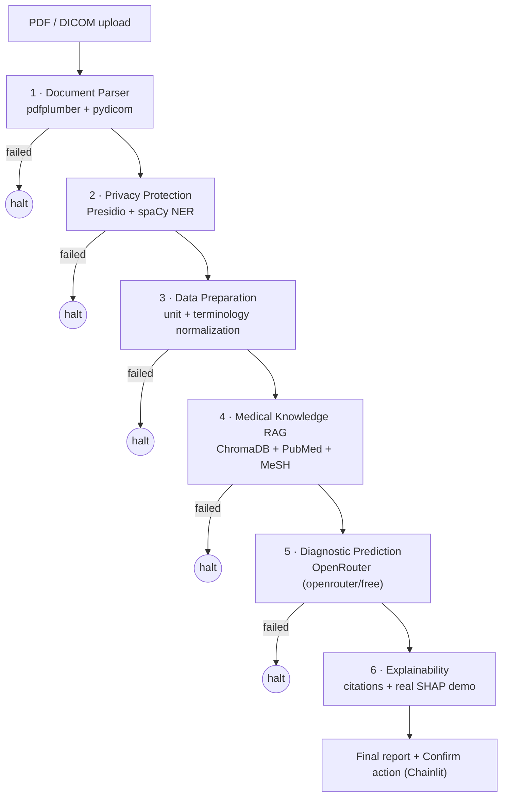

# Glassbox MD

An explainable medical AI agent pipeline: six agents that turn imaging,
labs, and symptoms into a diagnosis a clinician can actually audit, not
just trust.

> **Educational / portfolio demonstration of a multi-agent explainable-AI
> architecture. Not an FDA-cleared or clinically validated medical device.
> Not validated for diagnostic accuracy. Must not be used with real patient
> data (PHI) or to inform actual clinical decisions. All outputs are
> illustrative only, not medical advice, and require qualified clinician
> review before any action.**
>
> See [`src/glassbox_md/disclaimer.py`](src/glassbox_md/disclaimer.py) --
> this text is defined once there and reused everywhere it needs to appear.

## Why this exists

The pitch this project is built from opens with a problem, not a feature
list: *"They can't just trust a 'black box' algorithm. They need to know
why a decision is made."* Six agents (parse → de-identify → normalize →
retrieve literature → predict → explain) exist to answer that, in order.

The full project brief -- research grounding in two cited papers, a
five-lens architecture critique, the revised design, risk table, and
roadmap this scaffold is built from -- lives in the published project
artifact (link in your conversation history). This README covers the code,
not the reasoning behind it.

## Architecture



`needs_review` (an implausible lab value, a low-confidence differential, a
close-call disagreement) is not shown above as its own branch because it
doesn't change the routing -- it continues to the next stage like `ok`
does, carrying the flag forward into the final report. Only `failed`
(nothing usable was produced) halts the pipeline early. See "Conditional
routing" under Design decisions below.

## Status

**Phases 0-9 done -- MVP complete**, plus four post-MVP fixes found by
live-testing the running app and by deliberately expanding validation
past the original nine cases, and two post-MVP V2 enhancements (real
MeSH-based concept matching for RAG, and real case persistence, both
below) closing gaps the project's own architecture critique and its own
"Known limitations" section named from the start. All six agents, wired
into one pipeline, with a working UI, validated across a spread of
synthetic cases. 144 automated tests passing, plus two things pytest
can't check by itself: a live OpenRouter call (Phase 5) and full manual
runs of the UI in a real browser (Phase 8, revisited below) -- see both
below.

**RAG V2: patient data now matches literature via real MeSH concept
IDs, not just embedding similarity.** The original architecture
critique recommended a 3-tier patient -> literature -> UMLS graph for
real citation traceability; this project has no UMLS/UTS license, so it
uses PubMed's own real MeSH indexing instead -- public, free, and
already present in every PubMed record this project fetches. Covers the
same 6 canonical clinical terms `data_preparation.py`'s
`TERMINOLOGY_MAP` already normalizes to; falls back to the old flat
similarity search for anything outside that vocabulary. Verified live,
not just in pytest: all 6 MeSH Descriptor IDs were resolved against real
NCBI data during development (not typed from memory), a real
50-abstracts-per-condition index was rebuilt from live PubMed, and a
real end-to-end query for "type 2 diabetes" returned 5 citations, all
concept-matched, all real PubMed URLs. 28 new tests
(`test_controlled_vocabulary.py`, extended `test_medical_knowledge_rag.py`);
zero changes needed to the ~20 pre-existing RAG-adjacent tests, since
their fixture data has no MeSH metadata and so exercises the same
fallback path the old flat search always did. See Design decisions
below for the full story.

**Case persistence V2: "Confirm reviewed by clinician" now means
something durable, and past cases are browsable in-app.**
`case_store.py` (stdlib `sqlite3`, zero new dependency) saves every
completed case's report the moment it's produced, and records a real
timestamp -- idempotently, see Design decisions -- when a clinician
confirms it. `on_chat_start` now offers a choice up front: upload a new
case, or browse and reopen recent ones. `ExplainableReport.
clinician_confirmed`, a field that has existed in the state schema
since Phase 0 but that nothing ever set, is finally real. Only the
already-redacted report/prediction/audit-log is ever persisted --
never raw uploads or pre-anonymization data (`save_case` calls
`assert_privacy_boundary_respected` before writing anything, a guard
that previously had exactly one production call site). 14 new tests
(`test_case_store.py`); zero changes to any existing test file.
Live-verified beyond pytest: a real case was uploaded, confirmed with a
real recorded timestamp, and reopened from a *separate* chat session
via Browse past cases, rendering identically and showing the
confirmation notice instead of a re-clickable button.

Run it: `chainlit run app.py -w`, then open the local URL it prints.

**Found after "MVP complete": an imaging-only input used to kill the
whole pipeline.** Uploading only an MRI or X-ray, with no lab report or
history text, made the Medical Knowledge RAG agent hard-fail (nothing to
build a literature query from) and halt the graph before the Diagnostic
Prediction agent -- the one agent that actually looks at the image --
ever ran. Fixed in both agents: RAG now treats "nothing to search with"
as a degraded `needs_review` result instead of a fatal one, and
Diagnostic Prediction's pre-call check now counts imaging as valid
clinical input on its own, not just labs/history text. Verified twice:
`tests/test_validation.py::test_case_imaging_only_reaches_a_full_report`,
and a live upload of a synthetic DICOM through the running app that
reached a real OpenRouter call with the image attached (a random-noise
test image, honestly -- it correctly returned zero confidence, which is
the right answer for meaningless pixel data, not a broken fix).

**Found after that: a real MRI photo could make the UI lie about
whether the backend was still working.** Uploading a stock MRI photo
(wrapped as DICOM to pass the file-type gate) showed "Could not reach
the server" mid-run, while the server's own logs showed the real
OpenRouter call had actually returned `HTTP 200 OK`. Root cause:
`app.py` drove the graph with LangGraph's *sync* `.stream()` inside an
`async def` handler, so Diagnostic Prediction's blocking `OpenAI`
client call (60-180s for a real image) froze Chainlit's asyncio event
loop and starved its own Socket.IO keepalive. Fixed by switching to
`.astream()`, which runs each node's sync function on a thread-pool
executor instead of the calling loop. See Design decisions below for
the full story and both ways it was verified.

**Phase 9 validation** (`tests/test_validation.py`) runs 14 diverse
synthetic cases through the real compiled pipeline -- not just the one
happy path Phase 7's own capstone test covers: a clean diabetes case, a
clean coronary-artery-disease case, an implausible lab value (flagged,
not blocked), an unrecognized lab test (halts cleanly, no crash), a
genuinely empty document (produces a real "insufficient evidence" report
instead of dying partway through -- see the imaging-only fix above), a
DICOM image alongside lab data (PHI-bearing tags confirmed stripped), an
imaging-only case (reaches a full report instead of halting), a
close-call differential (correctly flagged for review), a case with five
different planted PHI-shaped identifiers (name, DOB, SSN, MRN, DICOM
patient name) swept against the *entire* downstream state as one
serialized blob -- not just checked in one field the way Phase 3's own
test did -- confirming none of them survive anywhere past the Privacy
Protection Agent, and five more added after a second pass specifically
looking for gaps the first nine didn't cover:

- **Multiple DICOM files uploaded together** -- both get parsed and
  anonymized, but only the *first* one's path is ever attached to the
  actual model call (`imaging[0]` in `diagnostic_prediction.py`). Not a
  crash, not silently wrong -- a real, now-documented scope limit, found
  the same way the imaging-only and malformed-response issues were:
  asking "what actually happens here" instead of assuming.
- **Multiple PDFs uploaded together** (a history note + a separate lab
  report) -- confirms Data Preparation correctly aggregates labs and
  history text across every parsed document, not just the first.
- **Evidence spanning both target conditions at once** (elevated glucose
  *and* elevated cholesterol, history mentioning both diagnoses) --
  confirms the differential isn't artificially forced onto a single
  condition when the evidence itself doesn't point to just one.
- **A corrupt file alongside a valid one** -- the Document Parser
  correctly returns `needs_review` (partial success) rather than
  `failed`, and the pipeline still reaches a full report using the file
  that did parse.
- **Retrieved literature the model never cites** -- confirms the
  Explainability Agent's citation resolver returns an empty citation
  list rather than erroring or inventing a citation, holding at the full
  pipeline level, not just in `explainability.py`'s own unit tests.

**What the live verification actually confirmed** (a real synthetic PDF,
uploaded through the running app, no mocks): all six agents rendered as
individual steps with correct status icons live as the graph executed;
the Medical Knowledge RAG agent correctly showed `needs_review` (no
literature index had been built); the Diagnostic Prediction agent made a
real OpenRouter call and correctly abstained (0.30 confidence, no lab
values in the test document); the Explainability agent assembled a report
with a real SHAP demo and a disagreement flag; the persistent disclaimer
banner rendered above everything; and the "Confirm reviewed" action
button worked -- sent a confirmation message and removed itself. See
`.files/` note under Design decisions for a real gap this testing found.

## Project structure

```
healthcare/
├── app.py                          Chainlit UI -- run with `chainlit run app.py -w` (done)
├── chainlit.md                     welcome-screen markdown (shown before first upload)
├── .chainlit/config.toml           name, file-upload limits, custom_css wiring
├── public/banner.css               the persistent disclaimer banner (pure CSS, no JS)
├── docs/
│   └── reference-images/     the 11 original pitch screenshots this project is built from
├── src/glassbox_md/
│   ├── state.py               MedicalPipelineState -- the LangGraph state schema
│   ├── audit.py                shared helper for building audit log entries
│   ├── disclaimer.py          the intended-use disclaimer, defined once
│   ├── pipeline.py             wires all six agents into one LangGraph StateGraph (done)
│   └── agents/
│       ├── data_preparation.py   unit conversion + terminology normalization (done)
│       ├── document_parser.py    PDF (pdfplumber) + DICOM (pydicom), separate paths (done)
│       ├── privacy_protection.py NER redaction, lab extraction, DICOM tag stripping (done)
│       ├── medical_knowledge_rag.py PubMed fetch + ChromaDB index/query (done)
│       ├── diagnostic_prediction.py Structured differential via OpenRouter (done)
│       └── explainability.py       Citation-grounded narrative + real SHAP demo (done)
├── scripts/
│   └── build_literature_index.py  offline: fetch PubMed, build the RAG index
├── data/
│   ├── README.md              what goes in each subfolder, and what must never go there
│   ├── imaging/                public/synthetic imaging data only
│   ├── tabular/                public tabular data, for the real SHAP demo
│   ├── literature/             PubMed abstract cache for the RAG agent
│   └── synthetic_patients/     self-generated fake documents, for testing redaction
├── tests/
│   ├── test_state.py           tests for the privacy-boundary runtime guard
│   ├── test_pipeline.py        conditional routing + full end-to-end graph test
│   └── test_validation.py      Phase 9: 14 diverse synthetic cases, full-state PII sweep
├── requirements.txt           dependencies, grouped by the phase that introduces them
├── pyproject.toml             project metadata + pytest config
└── .env.example                copy to .env and fill in API keys (never commit .env)
```

## Setup

```bash
python -m venv .venv
.venv\Scripts\activate        # Windows
pip install -r requirements.txt   # or just the Phase 0 group -- see requirements.txt
pip install -e .
copy .env.example .env        # then fill in your API key(s)
pytest
```

`requirements.txt` lists every phase's dependencies up front so the shape
of the environment is visible, but several groups (spaCy's language
model, chromadb's first embedding-model download, shap's native build)
are slow and better installed deliberately when you reach that phase
rather than as a side effect of one big install.

To make the RAG agent actually return results (Phase 4), build the
literature index once, offline:

```bash
python scripts/build_literature_index.py
```

This fetches PubMed abstracts for the project's two target conditions
and indexes them into `data/literature/chroma/`. Takes a few minutes;
safe to re-run.

To run the UI (Phase 8), with `.env` filled in (`OPENROUTER_API_KEY` at
minimum):

```bash
chainlit run app.py -w
```

`-w` enables auto-reload on file changes. Opens at `http://localhost:8000`.
Upload a lab-report/history PDF and/or a DICOM file to run it through
the pipeline; each agent renders as its own step as it completes.

## Known limitations

Scoped deliberately, not accidentally -- each of these is discussed in
more depth under Design decisions below, but a portfolio reviewer
shouldn't have to read thirty bullet points to find the honest gaps:

- **Two conditions only** (type 2 diabetes, coronary artery disease), not
  general medicine -- an unrecognized lab test or condition is rejected,
  not silently guessed at.
- **RAG now does real concept-level matching, not just flat vector
  search -- but only for 6 terms, and not via UMLS.** Patient data is
  matched to literature genuinely MeSH-indexed under the same clinical
  concept (real, checkable PubMed metadata -- see Design decisions),
  falling back to flat similarity outside that 6-term vocabulary or for
  literature with no MeSH tags yet. Still not the full UMLS-backed
  3-tier graph the original architecture critique recommended -- this
  project doesn't have a UTS license, and MeSH is a real, free
  substitute for the controlled-vocabulary tier, not the same ontology.
- **The SHAP demo never explains the current patient.** It runs on a
  public dataset, by design, and says so in the report -- see why under
  Design decisions. Explaining an actual case is the citation-grounded
  narrative's job, not SHAP's, in this design.
- **PII redaction covers 8 of the 18 HIPAA Safe Harbor identifier
  categories** (names, dates, phone/fax, email, geographic subdivisions,
  SSNs, URLs, IPs, plus a custom medical-record-number pattern) via
  Presidio + spaCy. Biometric identifiers, full-face photographs
  (pixel-level DICOM defacing), and vehicle identifiers are not
  addressed -- listed explicitly in `privacy_protection.py`, not implied
  away.
- **Case persistence is one local SQLite file, not a real database
  service.** `case_store.py` gives "Confirm reviewed by clinician" a
  real, durable record (see Status/Design decisions below) -- but it's
  a single file, adequate for this MVP's local single-user demo, not a
  concurrent-multi-writer store. A real deployment would need a
  client-server database, the same class of explicit scale cap as the
  RAG agent's linear concept-matching scan.
- **Up to `MAX_IMAGES_PER_CALL` (4) images reach the model per case.**
  Fixed after `test_case_multiple_dicom_files_all_reach_the_model` (Phase
  9) found the opposite: an earlier version only ever attached the first
  uploaded image (`imaging[0]`), silently dropping every image past it.
  The cap itself is deliberate, not arbitrary neglect -- unbounded image
  count risks payload-size/latency problems on an already-slow (~70s)
  free-tier call; exceeding it is noted in the audit log, not silently
  truncated. See Design decisions below.
- **The LLM provider is a free-tier router** (`openrouter/free`), chosen
  after two dead ends with paid/blocked providers (see below). Expect
  ~70s latency and don't expect a fixed model identity from run to run --
  not a production-grade reliability story. Concretely observed, not
  hypothesized: a request with a synthetic brain-MRI-shaped image got
  back a bare content-safety verdict instead of an answer, twice in a
  row. Retried automatically now (see Design decisions), but whether the
  underlying model can meaningfully interpret real medical imagery at
  all -- safety-filtering aside -- has not been verified either way.
- **No formal clinical validation** -- no accuracy, sensitivity, or
  specificity metrics against a labeled dataset, and none are claimed.
  This is a portfolio demonstration of an architecture, not a validated
  diagnostic tool; see the disclaimer at the top of this file.
- **English-only.** `en_core_web_sm`'s NER recall on non-English or
  unusual names is not something this project has tested or tuned for.

## Design decisions worth knowing

- **State schema.** `MedicalPipelineState` adds a `stage_status` dict and
  an accumulating `audit_log` on top of the original design, so a failed
  node can be routed instead of crashing the whole chain, and the
  pipeline's own reasoning trail lives in the state -- not just in the
  final report string.
- **Privacy boundary.** `assert_privacy_boundary_respected()` is a runtime
  check, not just a type hint: it raises if `raw_input_paths` (which can
  embed PHI in a filename) is still present once `anonymized_patient_data`
  exists. Call it at the boundary of any node that isn't the parser or
  privacy agent, especially before the two nodes that call an external API.
- **UI (Phase 8, not yet built): Chainlit**, not Streamlit or Gradio.
  Chainlit's native step/thread view maps directly onto a six-agent
  pipeline -- each agent renders as its own collapsible step with its own
  output, which is a better fit for a project about showing *how* an
  answer was reached than a generic chat widget or form-builder is.
- **`stage_status` merge gotcha, found while building Phase 1.** Only
  `audit_log` has a LangGraph reducer (`operator.add`, so it accumulates
  automatically). `stage_status` doesn't -- a node that returned
  `{"stage_status": {"data_preparation": ...}}` directly would silently
  wipe out every other stage's recorded status, not merge into it. Every
  agent must build its update through `update_stage_status()` in
  `state.py` instead. Covered by
  `test_agent_preserves_other_stages_status` in
  `tests/test_data_preparation.py` -- when you write Phase 2's agent,
  write the equivalent regression test before assuming this works.
- **PDF parsing: pdfplumber, not Marker/Docling as originally pitched.**
  Both of those are ML-based parsers built for messy scanned documents and
  pull in torch as a transitive dependency -- a multi-hundred-MB-to-GB
  install for what this MVP needs, which is text extraction from synthetic,
  born-digital PDFs this project generates itself. DICOM still gets its
  own separate path via pydicom, per the critique's finding that neither
  Marker nor Docling reads DICOM at all regardless of which one you'd
  picked. See `agents/document_parser.py`'s module docstring for the
  swap-back path if this project is ever pointed at real scanned documents.
- **DICOM pixel data never enters LangGraph state.** `parse_dicom()`
  returns a shape/dtype summary, not the raw array -- keeping large binary
  imaging data out of the state dict avoids the same unbounded-PHI-copy
  risk the critique raised about LangGraph checkpointing. Anything that
  needs actual pixel data reads it from the file path directly.
- **Structured lab extraction lives in the Privacy agent, not the Parser
  or Data Prep agent.** Data Preparation (Phase 1) was built expecting
  `anonymized_patient_data["labs"]` to already be structured as
  `{"glucose": {"value": 126, "unit": "mg/dL"}}`. Something has to turn
  pdfplumber's raw extracted tables into that shape, and the Privacy agent
  is the natural place: it already has to scan the same raw content to
  redact it. See the module docstring in `privacy_protection.py` for the
  full reasoning.
- **"HIPAA compliance" and "differential privacy" are gone from this
  agent's naming**, replaced with what it actually does: NER-based
  redaction (Presidio + spaCy) for 8 of the 18 HIPAA Safe Harbor
  identifiers, a custom pattern recognizer for medical record numbers, and
  DICOM tag stripping for device/institution identifiers. Coverage gaps
  (biometrics, face photos, vehicle identifiers) are listed explicitly in
  the module docstring rather than implied away by a blanket "compliant"
  claim -- per the privacy critique.
- **spaCy model: `en_core_web_sm`, not `_lg`.** ~15MB vs ~587MB, lower
  NER recall on unusual names -- fine for this MVP's synthetic test
  corpus, not a claim about production-grade recall on messy real text.
- **A real gotcha found while testing:** Presidio's `US_SSN` recognizer
  explicitly denylists `123-45-6789` -- the one SSN everyone reaches for
  in a tutorial -- specifically so it doesn't false-positive on sample
  text. First test write used exactly that number and silently detected
  nothing. Fixed by using a realistic-but-arbitrary number instead;
  see `test_redacts_ssn` in `tests/test_privacy_protection.py`.
- **RAG embeddings: ChromaDB's bundled `DefaultEmbeddingFunction`, not
  sentence-transformers as the roadmap originally named.** Installing
  chromadb alone already pulls in `onnxruntime`, and its default
  embedding function runs the same class of model (an ONNX
  all-MiniLM-L6-v2, ~80MB, downloaded once and cached) that
  sentence-transformers would have used via torch. Confirmed by actually
  loading it and embedding text before committing to this, not assumed --
  see the module docstring in `medical_knowledge_rag.py`.
- **PubMed fetching: the E-utilities REST API directly (stdlib
  `urllib`/`xml.etree`), not biopython.** Biopython's `Entrez` module
  wraps the same two HTTP endpoints (esearch, efetch); calling them
  directly avoids a dependency for two URLs. Smoke-tested against the
  live API, not just parsed from fixture XML -- see
  `scripts/build_literature_index.py`.
- **Literature retrieval is a build step, not a live pipeline call.**
  `scripts/build_literature_index.py` fetches and indexes PubMed
  abstracts once, offline; the agent only ever queries the already-built
  ChromaDB collection at pipeline run time. Re-running the script is safe
  -- indexing uses upsert, so existing PMIDs update in place.
- **RAG's concept-matching tier uses real MeSH IDs, verified live
  against NCBI, not typed from memory.** The architecture critique's
  3-tier design named UMLS as the controlled-vocabulary layer; this
  project has no UTS license, so `controlled_vocabulary.py` uses PubMed's
  own MeSH indexing instead -- public domain, and already present in
  every EFetch response this project fetches (previously parsed for
  nothing). Each of the 6 canonical-term -> MeSH-Descriptor-UI mappings
  was resolved by querying live NCBI E-utilities during development (one
  real on-topic article's actual `DescriptorName UI`, or for narrower
  terms, `db=mesh`'s own `ds_meshui` field cross-checked against its
  entry-term list) -- not guessed or recalled, because a wrong ID would
  silently match the wrong concept. `query_literature_by_concept` finds
  eligible literature via a Python-side scan of stored `mesh_ids`
  metadata (Chroma's `where` has no substring-containment operator for a
  comma-joined string) and then ranks that eligible subset with a normal
  `where={"pmid": {"$in": [...]}}` query -- fine at this MVP's
  few-thousand-abstract scale, a documented V3 item (a real index) at an
  order of magnitude more. Live-verified end to end: rebuilding a real
  50-abstracts-per-condition index and querying it for "type 2 diabetes"
  returned 5 real citations, all concept-matched, all real PubMed URLs.
  Falls back to exactly the old flat-similarity behavior for anything
  outside the 6 terms or for literature with no MeSH tags yet (many very
  recent articles aren't MeSH-indexed by NCBI yet either -- confirmed
  live: only 25 of 94 freshly-fetched abstracts had any MeSH tags at
  all), which is also why every one of the ~20 pre-existing RAG-adjacent
  tests across `test_validation.py`/`test_pipeline.py` needed zero
  changes -- their fixture abstracts simply have no MeSH metadata, so
  they exercise the same fallback path unchanged.
- **Case persistence: stdlib SQLite, a fresh connection per call, and an
  idempotent confirm.** `case_store.py` adds zero new dependencies
  (`sqlite3` is stdlib) -- the same "reuse what's already there" call
  made for pdfplumber, raw E-utilities, and MeSH-over-UMLS. No
  connection is cached at module scope: `_default_collection()` in
  `medical_knowledge_rag.py` already established the same
  open-per-call pattern, for the same reason -- a cached connection
  would bind to whichever thread first imported the module and raise on
  a call from another, and every `case_store` call from `app.py` is
  wrapped in `asyncio.to_thread(...)` (the exact class of blocking
  concern the `astream()` fix already documented, applied defensively
  here even though a sqlite write is milliseconds, not the 60-180s LLM
  call). `confirm_case` is intentionally idempotent (`confirmed_at =
  COALESCE(confirmed_at, ?)`): a double-click, two sessions, or
  reopening an already-confirmed case can never overwrite the true first
  confirmation time -- confirmation is one immutable audit fact, which
  is also why the UI hides the clickable action entirely once a case is
  confirmed rather than leaving it re-clickable. `save_case` calls
  `assert_privacy_boundary_respected` before opening a database
  connection at all -- fail-closed, not a partial write rolled back --
  and only ever persists `final_explainable_report`,
  `diagnostic_prediction_result`, and `audit_log`; every `audit_entry()`
  summary across all six agents was checked and is a count/category
  string, never raw content, before deciding that field was safe to
  include.
- **Diagnostic Prediction Agent output is a ranked differential, never
  "the diagnosis."** `DifferentialCondition` entries carry a likelihood
  and evidence citations, not a single verdict, per the clinical-safety
  critique. Abstention is two-stage: before the model is even called (no
  clinical data or literature to reason over) and after (confidence below
  `CONFIDENCE_THRESHOLD`) -- a low-confidence result is surfaced as
  "insufficient evidence," not dressed up as a normal answer.
- **Model provider: OpenRouter's free router, after two dead ends.** Built
  first against Gemini (`google-genai`) -- worked in code, but a real key
  hit a persistent `API_KEY_SERVICE_BLOCKED` permission error from Google
  that survived enabling the API and checking billing. Moved to OpenAI
  next; it has no meaningful free tier (billing required even for trial
  credit). Landed on OpenRouter's `openrouter/free` router: a real hosted
  API (unlike a local Ollama model, which can't be reached by a deployed
  app), genuinely free, auto-selecting whichever underlying model
  currently supports both image input and structured output. The
  structured-output schema (`ModelDifferentialResponse`) didn't change
  across any of the three attempts -- only the client configuration did.
  Because the free router can land on any model, the agent uses plain
  JSON mode plus hand validation instead of strict schema-constrained
  decoding, with the required shape spelled out in the system prompt.
  Live-verified end to end, not just mocked: `test_live_openrouter_call_
  smoke_test` makes a real call and got back a valid differential (~70s,
  free-tier routing overhead -- worth knowing if this ever needs to feel
  fast).
- **Imaging is best-effort, not required.** DICOM pixel data converts to
  PNG for the multimodal prompt when available; a missing or unreadable
  image degrades to a text-only call rather than failing, since the two
  MVP conditions (type 2 diabetes, coronary artery disease) are primarily
  lab/history-driven rather than imaging-diagnosed.
- **The Explainability Agent's SHAP demo is deliberately not applied to
  the current patient.** It runs on scikit-learn's built-in
  `load_diabetes` dataset (no network fetch), clearly labeled in the
  report as a general capability demonstration. That dataset's features
  are scaled by sklearn with no exposed inverse transform, so forcing
  this project's real mmol/L lab values through it would produce SHAP
  numbers that look precise but mean nothing -- exactly the
  "technically incorrect but authoritative-looking" failure mode this
  whole project exists to avoid. Explaining this patient's actual case
  is what the citation-grounded narrative is for; the SHAP demo proves
  the technique works on a real model, honestly scoped as a demo.
- **`disagreement_flagged` is a real signal, not a placeholder.** It's
  true when the model's own top two differential hypotheses sit within
  `DISAGREEMENT_MARGIN` (0.15) of each other, or when the Diagnostic
  Prediction Agent already abstained. It is deliberately NOT a
  comparison between the SHAP demo and the patient's differential --
  those run over incompatible feature spaces on unrelated data, and
  manufacturing a cross-check between them would itself be a
  technically-incorrect comparison dressed up as insight.
- **`clinician_confirmed` always starts `False`.** This agent produces a
  report for review, not a released result -- setting it `True` is a
  UI/human action (Phase 8), never something an agent decides for itself.
- **Conditional routing treats `needs_review` and `failed` as genuinely
  different things.** Every stage transition checks
  `stage_status[stage]["status"]`: `"failed"` routes straight to `END`
  (nothing usable was produced, nothing downstream can work); `"needs_
  review"` continues normally, since it means a stage produced real,
  usable output that a human should look at (an implausible lab value, a
  low-confidence differential, a close-call disagreement) -- not that the
  stage produced nothing. Collapsing those two into one "stop the
  pipeline" behavior would have thrown away exactly the flags the
  clinical-safety critique wanted surfaced, not hidden.
- **Retry/timeout lives inside the agent, not the graph.** LangGraph's
  own per-node `retry_policy` triggers when a node raises -- but every
  agent in this pipeline deliberately never raises (Phases 1-6 all
  convert failures into a recorded `stage_status` entry instead, on
  purpose). A graph-level retry would never fire. The actual retry (3
  attempts, short backoff, transient errors only -- never auth/permission
  errors, since this project's own Gemini attempt showed retrying one of
  those is pointless) and the 90-second timeout (generous because the
  free router's observed real-world latency is ~70s) live in
  `diagnostic_prediction.py`'s `_call_openrouter`, the one call that can
  actually be transiently wrong.
- **What counts as "transiently wrong" includes a malformed response, not
  just network errors -- found live, not hypothesized.** Uploading a
  synthetic brain-MRI-shaped DICOM (skull ring, textured tissue,
  ventricles -- not just noise) got back the literal string
  `"User Safety: safe"` from whatever model `openrouter/free` routed the
  request to, twice in a row -- a content-safety classifier's verdict
  leaking through instead of an actual answer, not valid JSON at all. The
  real API call succeeded (HTTP 200); the content was just unusable.
  `_call_openrouter` now validates the response *inside* the same retry
  as the network call, with `pydantic.ValidationError` and an empty-body
  `ValueError` added to the retryable set -- since the free router can
  land on a different underlying model each attempt, a model that
  ignored the JSON instruction once isn't necessarily the model a retry
  will get. Covered by `test_call_openrouter_retries_a_malformed_
  response_then_succeeds` and `test_call_openrouter_gives_up_after_
  repeated_malformed_responses` in `tests/test_diagnostic_prediction.py`.
  Whether the underlying model can meaningfully interpret real medical
  imagery at all, safety-filtering aside, remains unverified -- see
  Known Limitations.
- **The whole graph is tested end to end, offline.** `test_pipeline_runs_
  all_six_stages_with_audit_log_accumulating` builds a real synthetic PDF,
  runs it through the real compiled `StateGraph` (all six real agents,
  not mocks), and checks the audit log accumulated one entry per stage in
  order -- with a fake LLM caller and a small local ChromaDB collection
  injected the same way Phase 4 and 5's own tests do it, so this needs no
  API key or pre-built literature index to run.
- **The pipeline streams, it doesn't just invoke.** `app.py` calls
  `_pipeline.astream(state)`, not `.invoke(state)` -- streaming yields
  after each node finishes, which is what lets each of the six agents
  render as its own step live as the graph runs. `.invoke()` would only
  return the final state, with nothing to show until everything finished.
- **`astream()`, not `stream()` -- a real bug found by live-testing a
  real MRI photo, not a synthetic image.** `app.py` originally drove the
  graph with `for chunk in _pipeline.stream(state)`, LangGraph's *sync*
  iterator, inside an `async def` handler. Diagnostic Prediction's real
  call (`_default_caller` in `diagnostic_prediction.py`) uses a blocking
  `OpenAI` client and can run 60-180s for a real image; iterated via
  `.stream()`, that blocking call froze the whole async handler -- and
  with it Chainlit's asyncio event loop -- for the entire wait, starving
  the Socket.IO keepalive ping until the browser decided the server was
  unreachable. Caught live, not hypothesized: uploading a stock MRI photo
  (wrapped as DICOM to pass the file-type gate) showed "Could not reach
  the server" in the UI, while the server's own logs showed the
  OpenRouter call return `HTTP 200 OK` a few seconds later -- the backend
  had actually succeeded, but nothing was left to render the result.
  Fixed by switching to `_pipeline.astream(state)`: per LangGraph's own
  Runnable execution model, a plain synchronous node function invoked
  through the async API runs on a thread-pool executor instead of inline
  on the calling event loop, so a slow node no longer blocks it. Verified
  two ways: `test_astream_keeps_the_event_loop_responsive_during_a_slow_
  llm_call` in `tests/test_pipeline.py` proves it at the level `app.py`
  actually depends on (a concurrent asyncio task keeps ticking while a
  deliberately slow fake LLM call is "in flight" inside `graph.astream`,
  rather than the loop freezing solid) -- and a real headless run of the
  actual pipeline against that same stock-photo-wrapped-DICOM file
  produced a real, sensible result (a low-confidence "unremarkable brain
  MRI" differential, correctly abstained) once the websocket wasn't in
  the way, confirming the backend's answer was right all along and only
  the UI's connection was the problem.
- **Disclaimer shown two ways, not one.** A `cl.Message` at chat start
  (so it's the very first thing a user sees) AND a persistent CSS banner
  (`public/banner.css`, using a `body::before` pseudo-element for the
  text, since Chainlit's `custom_css` hook can style the page but doesn't
  give a template hook to inject real markup) that stays fixed at the top
  through the whole session -- a chat message scrolls out of view once
  six steps and a report fill the screen; the banner doesn't. Keep the
  banner text in sync with `INTENDED_USE_BANNER` in `disclaimer.py` by
  hand -- there's no build step sharing the string between Python and
  static CSS.
- **A real gap this testing found: `.files/`.** Chainlit writes every
  uploaded document to a `.files/` directory at the project root while
  the app runs -- verified by actually uploading a test PDF and watching
  it land on disk. That directory was missing from `.gitignore` until
  this phase. It's exactly the kind of real-or-synthetic patient document
  `data/README.md` already says doesn't belong in version control, just
  written by a framework instead of by hand -- now gitignored.
  `.chainlit/translations/` (auto-generated, ~400KB of locale JSON,
  regenerated by Chainlit on next run) is excluded for the same
  "don't commit generated framework boilerplate" reason, not a privacy one.
- **Confirmation is a click, not a checkbox in the data.** The "Confirm
  reviewed by clinician" action sends a message and removes itself
  (`action.remove()`); it does not, and cannot, reach back into
  `final_explainable_report` and flip `clinician_confirmed` on some
  persisted record, because this MVP has no case-persistence layer yet
  (each chat session is its own ephemeral run). Wiring confirmation to an
  actual stored record is a V2 item once cases are persisted at all.
- **UI verification is manual, not a pytest suite.** Chainlit's render
  functions (`cl.Message`, `cl.Step`, `cl.Action`) need a live Chainlit
  context to run -- there's no accessible harness for unit-testing them
  the way `pipeline.py` or any agent gets tested. The evidence for this
  phase is the live browser run described above, the same role the live
  OpenRouter call plays for Phase 5.
- **UI polish reads structured data directly, not the pre-formatted
  narrative string.** `_render_final_report` builds the differential as
  an actual Markdown table from `diagnostic_prediction_result` in state,
  not by re-parsing `final_explainable_report["narrative"]` -- that
  string is a flattened version of the same data, built for a UI with
  nowhere better to put it (or none at all, if this project only had a
  CLI). This one has somewhere better, so it uses the structured data
  directly and only falls back to the narrative string when there's
  nothing to tabulate (an abstained case with an empty differential).
  The confidence badges (🟢/🟡/🔴, one per condition plus one for the
  overall score) use the exact `CONFIDENCE_THRESHOLD` the backend
  abstention logic itself uses, imported rather than duplicated as a
  literal -- the visual cue can't silently drift from what "low
  confidence" actually triggers. A heads-up message before the pipeline
  runs sets expectations for the ~90s wait a real model call can take,
  so that latency reads as expected behavior, not a hang. Verified live
  in a browser with a real OpenRouter call: a genuine 3-row rendered
  Markdown table with colored badges, not literal pipe characters.
- **Scope: two conditions, not general medicine.** The Data Preparation
  Agent's lab-conversion table (glucose, cholesterol panel, triglycerides,
  creatinine, HbA1c) and terminology map are scoped to type 2 diabetes and
  coronary artery disease specifically, chosen to match the UCI datasets
  already planned for the RAG and SHAP-demo phases. An unrecognized lab
  test raises `UnknownLabTestError` rather than silently passing the value
  through unconverted -- expanding scope later means adding entries to
  `LAB_CONVERSIONS`, not relaxing that check.
- **The privacy sweep checks the whole state, not one field.**
  `test_case_planted_pii_absent_from_entire_final_state` (Phase 9)
  serializes the *entire* downstream state to JSON and searches for each
  planted identifier, rather than checking `history_text` specifically
  the way Phase 3's own test does. That's deliberately the stronger check
  for a final validation pass: it would also catch a leak into
  `structured_clinical_data`, `rag_literature_context`, or
  `final_explainable_report` that a narrower, field-specific test could
  miss simply because nobody thought to check that particular field.
- **Found by a user's question, not by inspection: imaging-only input used
  to kill the whole pipeline.** "What if all we have is an MRI or X-ray?"
  turned out to expose a real bug spanning two agents, both of which only
  ever checked labs/history text and never imaging:
    - The RAG agent built its literature-search query from labs/history
      text alone; with neither present, it returned `failed`, and per the
      routing rule, `failed` halts the graph immediately -- before
      Diagnostic Prediction, the one agent that actually looks at the
      image, ever ran.
    - Diagnostic Prediction's own pre-call abstention check had the same
      blind spot (`has_clinical_data = bool(labs) or bool(history_text)`)
      -- even if RAG hadn't halted things first, this check would have
      abstained too, never sending the image its own
      `_load_image_for_prompt` was already built to attach.
  Fixed both: RAG now treats "nothing to search with" as a degraded
  `needs_review` result (empty citations), the same as "searched and
  found nothing," instead of a fatal one; Diagnostic Prediction's check
  now includes `bool(imaging)`. A side effect worth knowing: a *fully*
  empty document (no text AND no imaging) now reaches a complete
  "insufficient evidence" report instead of dying partway through too --
  the pre-call abstention path didn't used to set
  `diagnostic_prediction_result` at all, so Explainability treated it as
  nothing to explain and failed one stage later. Both fixes are exercised
  together, end to end, in
  `test_case_imaging_only_reaches_a_full_report` and
  `test_case_empty_document_still_produces_an_explained_report` in
  `tests/test_validation.py` -- and verified live, not just in tests, by
  actually uploading a synthetic DICOM through the running app and
  watching a real OpenRouter call happen with the image attached.
- **Every uploaded image now reaches the model, not just the first.**
  `test_case_multiple_dicom_files_all_reach_the_model` (Phase 9's
  expanded validation) uploaded two MRIs together and found only the
  first ever got attached to the actual model call --
  `diagnostic_prediction_agent` built `image_path` from `imaging[0]`
  alone, and `LLMCaller`'s signature only had room for one path in the
  first place. Fixed by changing the interface itself: `LLMCaller` now
  takes `image_paths: list[str]`, `_default_caller` attaches every
  image it can convert (`_load_images_for_prompt`, plural), and a short
  text note (`"(N imaging files are attached below.)"`) is added to the
  prompt when there's more than one, so the model doesn't treat a
  second image as unrelated noise. Capped at `MAX_IMAGES_PER_CALL` (4)
  to keep payload size and latency bounded on an already-slow (~70s)
  free-tier call -- exceeding the cap is recorded in the audit log
  (`"N additional image(s) not sent"`), not silently dropped. Regression
  tests at both the agent level (`test_agent_sends_every_uploaded_
  image_not_just_the_first`, `test_agent_caps_images_at_max_and_notes_
  the_drop_in_the_audit_log` in `tests/test_diagnostic_prediction.py`)
  and the full-pipeline level (`tests/test_validation.py`).
